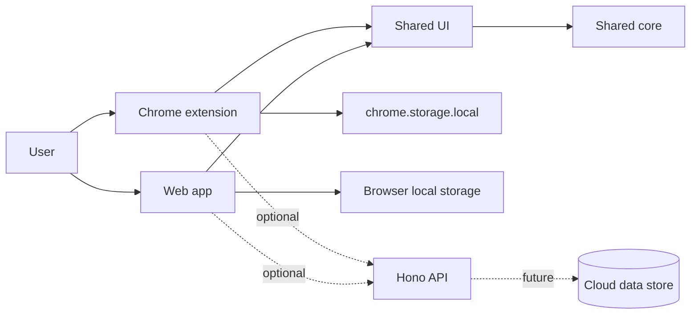

# Architecture

Navode is a pnpm workspace monorepo. The local-first interface is usable without the optional API.

## Boundaries

- `apps/web`: React/Vite implementation of the Navode shell.
- `apps/extension`: React/Vite Manifest V3 new-tab implementation. It uses the `storage` permission only, via a local-storage adapter.
- `apps/api`: optional Hono Worker with health and version endpoints only.
- `packages/core`: framework-free command resolver, URL-safety validation, alias/history and organizational CRUD domain logic, plus versioned storage-schema migrations.
- `packages/integrations`: framework-free provider definitions, connection and permission concepts, cache-first refresh coordination, and provider-local error/backoff handling. It does not hold credentials or access browser APIs.
- `packages/ui`: reusable React presentation components shared by web and extension, including the app shell, dialogs, controls, and command-result affordances. It receives settings through props rather than reading browser APIs.
- `packages/config`: shared non-secret application constants.

V2.2 activates GitHub and V2.3 activates Google Calendar in the extension through the official `chrome.identity` OAuth flow. V2.4 activates the competitive-programming provider with a Codeforces-only adapter: it requests the optional `codeforces.com` origin only when connected, uses documented public API endpoints, and accepts an optional public handle. The adapter owns Codeforces types and API mapping so another platform can be added without affecting the shared integration model. The core package must not depend directly on React or Chrome APIs.

## Data and deployment

The extension owns its settings in `chrome.storage.local` through `apps/extension/src/storage.ts`; web storage is browser-local. Theme, onboarding completion, reduced-motion and home preferences, default provider, aliases, bounded non-sensitive action history, links, projects, workspaces, productivity data, integration connection metadata, project-health targets, and provider caches use a shared versioned settings model in `packages/core`, with host-specific persistence adapters. Schema v1 through v7 migrate deterministically to the current v8 before use. V2.5 adds up to 20 user-configured http(s) service checks, each with an expected status, and a bounded local cache of the last result. Integration credentials are not part of this settings record.

Project-health checks run directly from the browser with an abortable eight-second request. The extension asks for the exact service origin only when the user saves that health check; the web companion can report CORS/network limitations rather than bypassing them. Navode deliberately has no arbitrary-URL proxy, server-side probe fleet, or monitoring backend. V2.6 keeps all live widgets opt-in and starts refresh work only after local settings have rendered; provider caches and errors remain isolated by integration.
