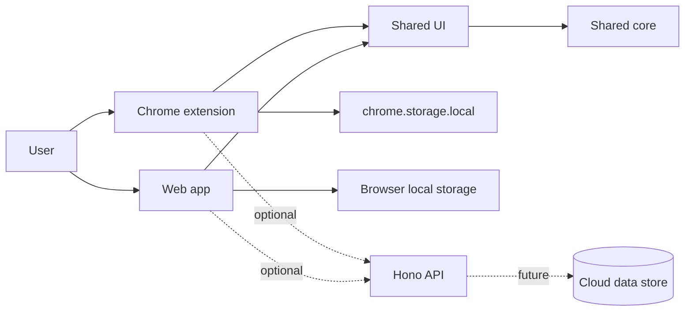

# Architecture

Navode is a pnpm workspace monorepo. The local-first interface is usable without the optional API.

## Boundaries

- `apps/web`: React/Vite implementation of the Navode shell.
- `apps/extension`: React/Vite Manifest V3 new-tab implementation. Its starter manifest uses no runtime permissions.
- `apps/api`: optional Hono Worker with health and version endpoints only.
- `packages/core`: framework-free command parsing and domain primitives.
- `packages/ui`: reusable React presentation components shared by web and extension.
- `packages/config`: shared non-secret application constants.

Future integration adapters and shared configuration should be added only when they acquire real consumers. The core package must not depend directly on React or Chrome APIs.

## Data and deployment

The extension will own its settings in `chrome.storage.local`; web storage is browser-local. Export/import is the portability and recovery path. The web app and API target Cloudflare later, but no production deployment is configured.
