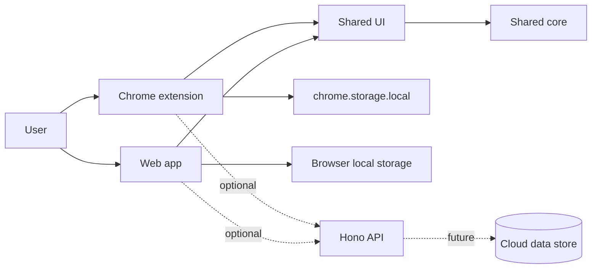

# Architecture

Navode is a pnpm workspace monorepo. The local-first interface is usable without the optional API.

## Boundaries

- `apps/web`: React/Vite implementation of the Navode shell.
- `apps/extension`: React/Vite Manifest V3 new-tab implementation. It uses the `storage` permission only, via a local-storage adapter.
- `apps/api`: optional Hono Worker with health and version endpoints only.
- `packages/core`: framework-free command resolver, URL-safety validation, alias/history and organizational CRUD domain logic, plus versioned storage-schema migrations.
- `packages/ui`: reusable React presentation components shared by web and extension, including the app shell, dialogs, controls, and command-result affordances. It receives settings through props rather than reading browser APIs.
- `packages/config`: shared non-secret application constants.

`packages/integrations` is intentionally deferred until an integration has a real V1 consumer; an empty package would not create a useful boundary. The core package must not depend directly on React or Chrome APIs.

## Data and deployment

The extension owns its settings in `chrome.storage.local` through `apps/extension/src/storage.ts`; web storage is browser-local. Theme, onboarding completion, reduced-motion and home preferences, default provider, aliases, bounded non-sensitive action history, links, projects, workspaces, and productivity data use a shared versioned settings model in `packages/core`, with host-specific persistence adapters. Schema v1 through v3 migrate deterministically to the current v4 before use. The hosts execute only resolver-produced, validated actions; workspace launches are user initiated and confirmed without extra Chrome permissions. Export/import is the portability and recovery path. The web app and API target Cloudflare later, but no production deployment is configured.
