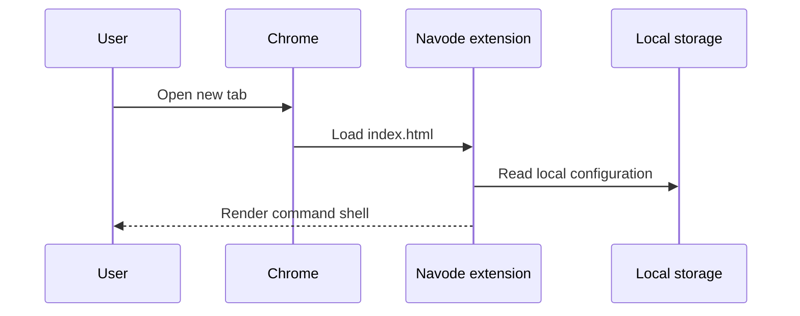
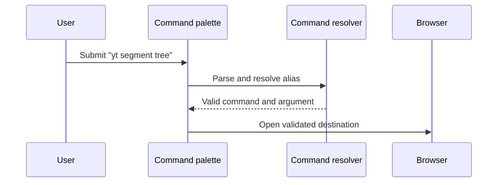

# Major flows

## Open a new tab

Initial rendering must be independent of a network request.

## Execute a command

Unknown commands should produce a useful local error rather than opening an unsafe URL. Project launch, focus, settings persistence, imports/exports, and optional API access follow the same rule: validate input at the boundary and keep the local feature independent of the API.
