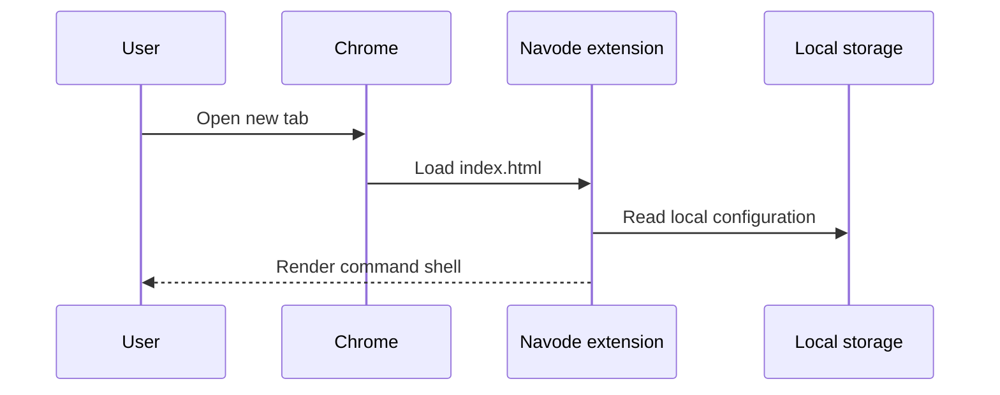
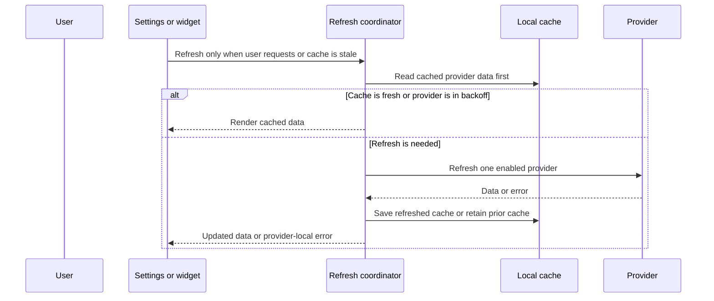
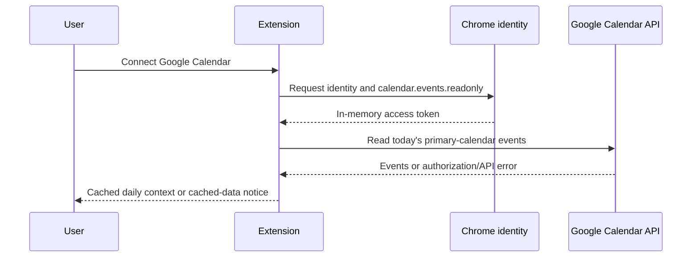
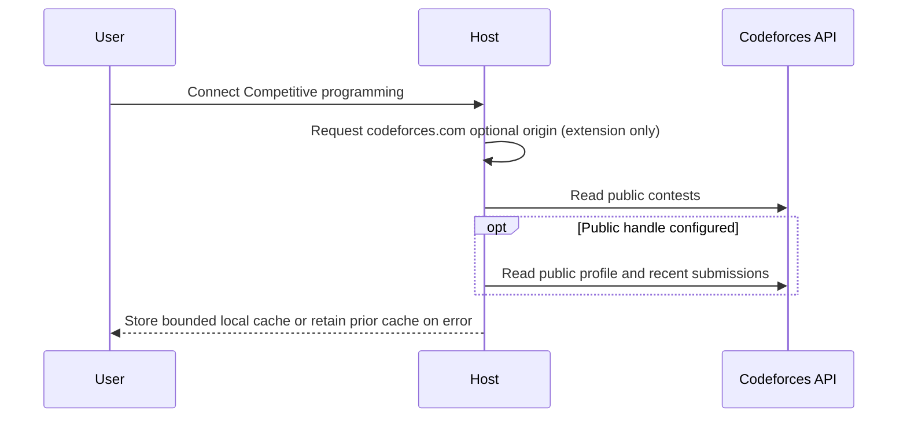
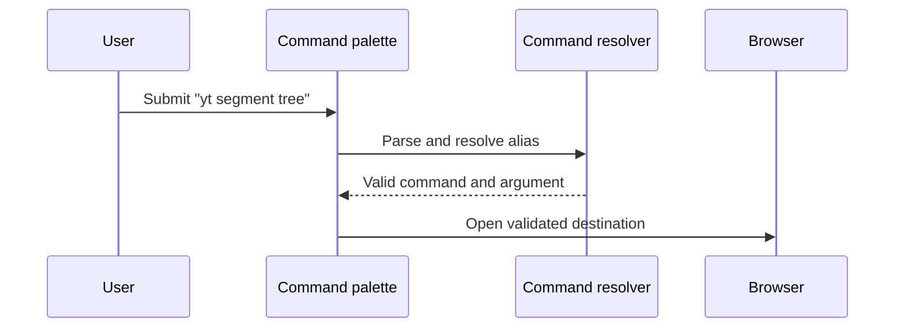

# Major flows

## Open a new tab

Initial rendering must be independent of a network request.

## Refresh an integration

A provider failure never prevents the New Tab shell from starting. V2.2's GitHub provider reads local cache first, requests the `api.github.com` origin only after the user connects it, and refreshes configured repositories only after the 10-minute cache window. A rate-limited response retains cached data and delays retry until GitHub's indicated reset time.

## Connect and refresh Calendar

No Gmail or Drive scopes are requested. The extension never sends Calendar data to Navode infrastructure.

## Connect and refresh Codeforces

The adapter uses Codeforces' documented public API and spaces calls to respect its public rate limit. It never asks for a Codeforces API key or stores credentials.

## Execute a command

The resolver supports public search aliases (`g`, `yt`, `gh`, `cf`, and `lc`), direct http/https URLs, custom aliases, and predictable local matches before using the selected provider as a fallback. Unsafe URL schemes produce a local error rather than navigation. It records only action labels and timestamps, never the input or search query. Workspace launches first show the number of destinations and open tabs only after confirmation. Project launch, focus, settings persistence, imports/exports, and optional API access follow the same rule: validate input at the boundary and keep the local feature independent of the API.
