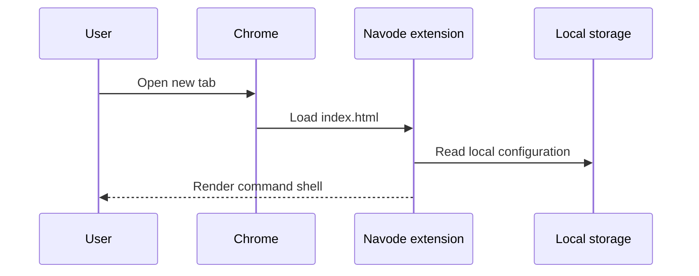
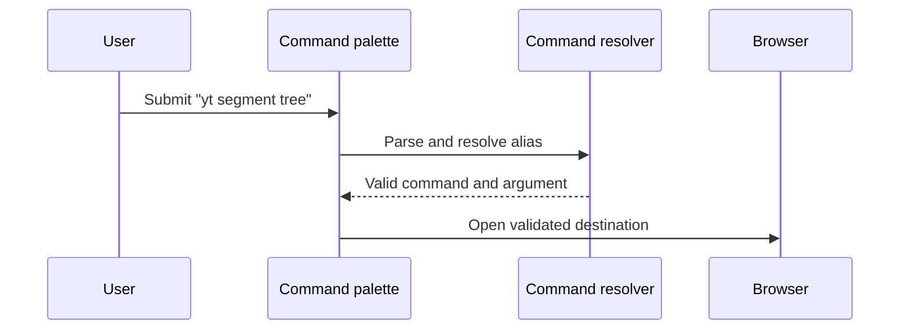

# Major flows

## Open a new tab

Initial rendering must be independent of a network request.

## Execute a command

The resolver supports public search aliases (`g`, `yt`, `gh`, `cf`, and `lc`), direct http/https URLs, custom aliases, and predictable local matches before using the selected provider as a fallback. Unsafe URL schemes produce a local error rather than navigation. It records only action labels and timestamps, never the input or search query. Project launch, focus, settings persistence, imports/exports, and optional API access follow the same rule: validate input at the boundary and keep the local feature independent of the API.
